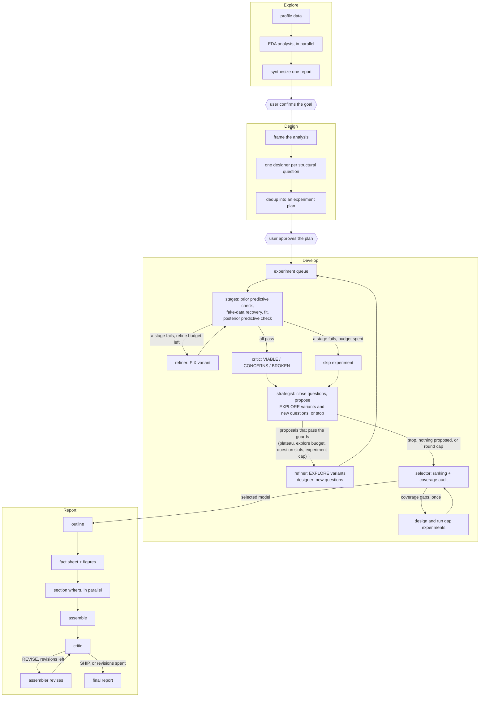

# Bayesian Workflow Claude Code Plugin

This plugin provides a workflow that runs in Claude Code.
The workflow is built to be run end to end, but we also provide a set of skills.

Currently the plugin is configured to use Stan and ArviZ.

When run end to end:



## Install

```
/plugin marketplace add sunxd3/bayesian-statistician-plugin
/plugin install bayesian-workflow@sunxd3-plugins
```

Needs [`uv`](https://docs.astral.sh/uv/) and a C++ toolchain for CmdStan.

## Use

```
/bayesian-workflow:setup                  # once per project: Python env + CmdStan
/bayesian-workflow:run <data file>
/bayesian-workflow:explore <data file>    # exploratory data analysis only
```
